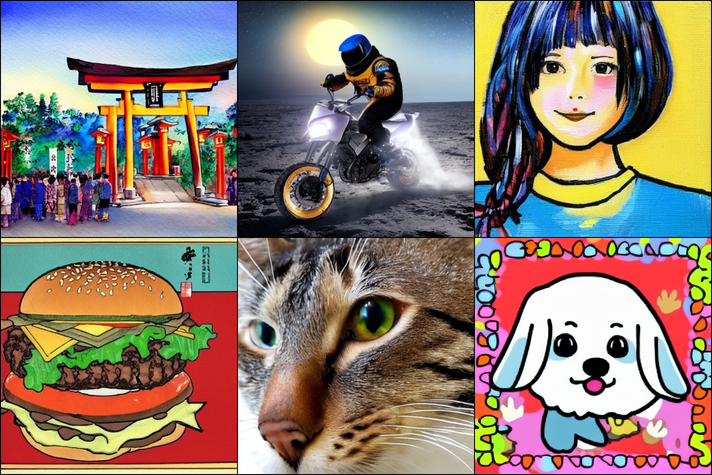
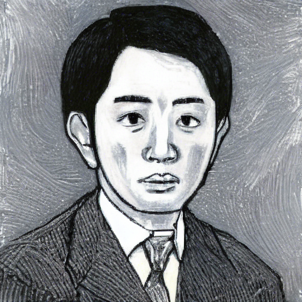

# Japanese Stable Diffusion




Japanese Stable Diffusion is a Japanese-specific latent text-to-image diffusion model.

This model was trained by using a powerful text-to-image model, [Stable Diffusion](https://github.com/CompVis/stable-diffusion). 
Many thanks to [CompVis](https://github.com/CompVis), [Stability AI](https://stability.ai/) and [LAION](https://laion.ai/) for public release. 

| Table of Contents |
|-|
| [News](#news) |
| [Model Details](#model-details) |
| [Usage](#usage) |
| [Citation](#citation) |
| [License](#license) |

## News
### September 9, 2022
- Release Japanese Stable Diffusion under the [CreativeML Open RAIL M License](LICENSE) in huggingface hub ([link](https://huggingface.co/rinna/japanese-stable-diffusion))

## Model Details
### Why Japanese Stable Diffusion?
Stable Diffusion is a very powerful text-to-image model, not only in terms of quality but also in terms of computational cost. 
Because Stable Diffusion was trained on English dataset, you need translate prompts or use directly if you are non-English users. 
Surprisingly, Stable Diffusion can sometimes generate nice images even by using non-English prompts. 
So, why do we need a language-specific Japanese Stable Diffusion?

Because we want a model to understand our culture, identity, and unique expressions such as slang. 
For example, one of the famous Japanglish is "salary man" which means a businessman especially we often imagine he's wearing a suit. 
Stable Diffusion cannot understand such Japanese unique words correctly because Japanese is not their target.

So, we made a language-specific version of Stable Diffusion! 
Japanese Stable Diffusion can achieve the following points compared to the original Stable Diffusion. 
- Generate Japanese-style images
- Understand Japanglish
- Understand Japanese unique onomatope
- Understand Japanese proper noun




*caption: "サラリーマン 油絵", that means "salary man, oil painting"*

### Training 
Japanese Stable Diffusion was trained by using Stable Diffusion and has the same architecture and the same number of parameters.
But, this is not a fully fine-tuned model on Japanese datasets because Stable Diffusion was trained on English dataset and the CLIP tokenizer is basically for English.
To achieve make a Japanese-specific model based on Stable Diffusion, we had 2 stages inspired by [PITI](https://arxiv.org/abs/2205.12952).

1. Train a Japanese-specific text encoder with our Japanese tokenizer from scratch with the latent diffusion model fixed. This stage is expected to map Japanese captions to Stable Diffusion's latent space. 
2. Fine-tune the text encoder and the latent diffusion model jointly. This stage is expected to generate Japanese-style images more. 

We used the following dataset for training the model:

- Approximately 100 million images with Japanese captions, including the Japanese subset of [LAION-5B](https://laion.ai/blog/laion-5b/).


## Usage

<a href="https://colab.research.google.com/github/rinnakk/japanese-stable-diffusion/blob/master/scripts/txt2img.ipynb" target="_parent"></a>

Firstly, install our package as follows. This package is modified [🤗's Diffusers library](https://github.com/huggingface/diffusers) to run Japanese Stable Diffusion.


```bash
pip install git+https://github.com/rinnakk/japanese-stable-diffusion
```

You need to accept the model license before downloading or using the weights. So, you'll need to visit its card, read the license and tick the checkbox if you agree.

- https://huggingface.co/rinna/japanese-stable-diffusion

You have to be a registered user in 🤗 Hugging Face Hub, and you'll also need to use an access token for the code to work. For more information on access tokens, please refer to [this section of the documentation](https://huggingface.co/docs/hub/security-tokens).
```bash
huggingface-cli login
```

Running the pipeline with the k_lms scheduler:

```python
import torch
from torch import autocast
from diffusers import LMSDiscreteScheduler
from japanese_stable_diffusion import JapaneseStableDiffusionPipeline

model_id = "rinna/japanese-stable-diffusion"
device = "cuda"
# Use the K-LMS scheduler here instead
scheduler = LMSDiscreteScheduler(beta_start=0.00085, beta_end=0.012, beta_schedule="scaled_linear", num_train_timesteps=1000)
pipe = JapaneseStableDiffusionPipeline.from_pretrained(model_id, scheduler=scheduler, use_auth_token=True)
pipe = pipe.to(device)

prompt = "猫の肖像画 油絵"
with autocast("cuda"):
    image = pipe(prompt, guidance_scale=7.5)["sample"][0]  
    
image.save("output.png")
```

_Note: `JapaneseStableDiffusionPipeline` is almost same as diffusers' `StableDiffusionPipeline` but added some lines to initialize our models properly._ 


Japanese Stable Diffusion pipelines also include 
- a [Safety Checker Module](https://github.com/huggingface/diffusers/blob/main/src/diffusers/pipelines/stable_diffusion/safety_checker.py), to reduce the probability of explicit outputs,
- an [invisible watermarking](https://github.com/ShieldMnt/invisible-watermark) of the outputs, to help viewers identify the images as machine-generated.


## Citation

```bibtex
@InProceedings{Rombach_2022_CVPR,
      author    = {Rombach, Robin and Blattmann, Andreas and Lorenz, Dominik and Esser, Patrick and Ommer, Bj\"orn},
      title     = {High-Resolution Image Synthesis With Latent Diffusion Models},
      booktitle = {Proceedings of the IEEE/CVF Conference on Computer Vision and Pattern Recognition (CVPR)},
      month     = {June},
      year      = {2022},
      pages     = {10684-10695}
  }
```

```bibtex
@misc{japanese_stable_diffusion,
    author    = {Shing, Makoto and Sawada, Kei},
    title     = {Japanese Stable Diffusion},
    howpublished = {\url{https://github.com/rinnakk/japanese-stable-diffusion}},
    month     = {September},
    year      = {2022},
}
```

## License
[The CreativeML OpenRAIL M license](LICENSE)  is an [Open RAIL M license](https://www.licenses.ai/blog/2022/8/18/naming-convention-of-responsible-ai-licenses), adapted from the work that [BigScience](https://bigscience.huggingface.co/) and [the RAIL Initiative](https://www.licenses.ai/) are jointly carrying in the area of responsible AI licensing. See also [the article about the BLOOM Open RAIL license](https://bigscience.huggingface.co/blog/the-bigscience-rail-license) on which our license is based.